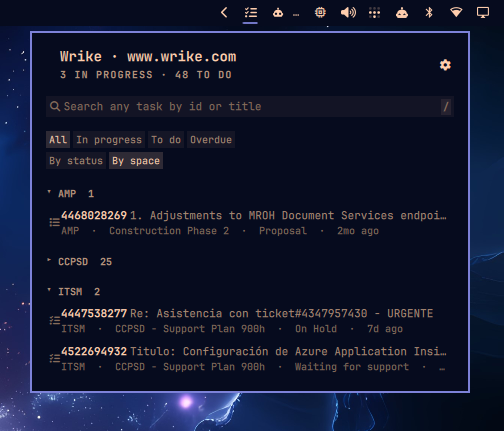

# Omarchy Wrike

Assigned Wrike tasks in the Omarchy bar. Filter the list, search the account, and open a task without leaving the desktop.



It is not a Wrike client. It answers two questions: what is on my plate, and where is task X.

## Quick path

1. Add the plugin and put it on the bar.
2. Open the panel and press the gear.
3. Paste a permanent token. The plugin checks it against Wrike before it stores anything.
4. Your assigned work appears grouped by space.

## Install

```bash
omarchy plugin add https://github.com/niusnet/omarchy-wrike.git --enable
```

`--enable` asks which bar section to use. The default is the right side.

### Update

```bash
omarchy plugin update niusnet.wrike
```

### Remove

```bash
omarchy plugin remove niusnet.wrike
```

Removing the plugin leaves the token in the keyring. Clear it from the gear (**Sign out**) or with:

```bash
~/.config/omarchy/plugins/niusnet.wrike/omarchy-wrike-auth --clear
```

## Dependencies

The plugin requires Omarchy Quattro and these tools on `PATH`:

```text
curl jq secret-tool
```

`secret-tool` comes from `libsecret`. The plugin does not install packages or change system config. It needs network access to your Wrike host (`www.wrike.com`, `app-eu.wrike.com`, or `app-us2.wrike.com`).

## Connect

You need a permanent token. In Wrike: **Profile → Apps & Integrations → API → Permanent access token**. The token inherits your own permissions.

Two ways to store it:

| Where | How |
| --- | --- |
| Panel settings | Open the panel, press the gear, enter the host and the token, then **Connect** |
| Terminal | `cd ~/.config/omarchy/plugins/niusnet.wrike && ./omarchy-wrike-auth` |

The host is `www.wrike.com`, `eu`, or `us2`. An empty token or Ctrl+C cancels. Nothing is stored until Wrike accepts the token.

**Sign out** on the same settings page removes the credential from this machine.

The token lives in the system keyring under `service=omarchy-wrike`. The plugin reads it at request time. It is never written to `shell.json`, never logged, and never placed on a process command line.

## What you see

The icon sits on the bar. Left click opens the panel. Right click refreshes.

The list is the work assigned to you. Completed and cancelled tasks stay out.

| Control | What it does |
| --- | --- |
| **All / In progress / To do / Overdue** | Filter the current list |
| **By status / By space** | Group the same tasks. Space is the default |
| Group header | Collapse or expand that group |
| A row | Open the in-panel preview |
| Search box | Filter the loaded list immediately, then search the whole account |

The preview stays in the panel. It shows the breadcrumb, status, description, comments, and a way to log time. Attachments live on their own tab. Comments load ten at a time. Open the task in the browser only when you want to.

## Settings

The gear (or `,`) is for Wrike-specific choices:

- **Spaces.** Untick the ones you do not care about. Ticked spaces feed the list and lead the search. The others stay searchable.
- **Connection.** Host, token, connect, and sign out.

Refresh interval and row count are ordinary widget settings:

| Setting | Default | Range |
| --- | --- | --- |
| Refresh interval | 900 seconds | 60–3600 |
| Maximum displayed tasks | 25 | 5–100 |

## Keyboard

| Input | Action |
| --- | --- |
| `j` / `k` / arrows | Move through rows |
| `Enter` | Open the highlighted preview |
| `o` | Open the task in the browser |
| `y` | Copy the highlighted permalink id |
| `/` | Focus search |
| `r` | Refresh |
| `,` | Open settings |
| `Escape` | Close the preview, then the panel |

## Search

Typing filters the tasks already loaded. After a short pause the same query goes to Wrike. Both sets land in one list.

```
109          the task whose permalink is open.htm?id=109
supplier     tasks with that word in the title
IEAAAAA…     a task by its API id
```

## How the list is grouped

Nothing keys off a status name. Every Wrike account names custom statuses freely, so `In Review` is a label, never a signal.

The portable signals are:

- Wrike's status group: `Active`, `Completed`, `Cancelled`, `Deferred`
- Whether the task has already started: a Planned task whose start date is today or earlier, or a Milestone whose due date has arrived

Completed and cancelled work is dropped. Started active work is **in progress**. Everything else assigned to you is **to do**. **Overdue** is assigned work whose due date has already passed.

When you group **By space**, each section is the real Wrike space that owns the task, not the inner folder.

## Local development

```bash
omarchy plugin validate .
tests/auth-test.sh && tests/helper-test.sh && tests/qml-source-test.sh
node --test tests/model.test.js
```

Run the helpers directly to see what the panel is given:

```bash
./omarchy-wrike-fetch | jq
./omarchy-wrike-fetch --search 109 | jq
```

QML changes need `omarchy restart shell`. Touching a file is not enough: the shell keeps the compiled version in memory.

`Service.qml` schedules `omarchy-wrike-fetch`, which owns every API call and every credential access and prints one JSON document. `Panel.qml` assembles the UI. `Model.js` holds the logic that is tested under `node --test`.

## License

MIT
